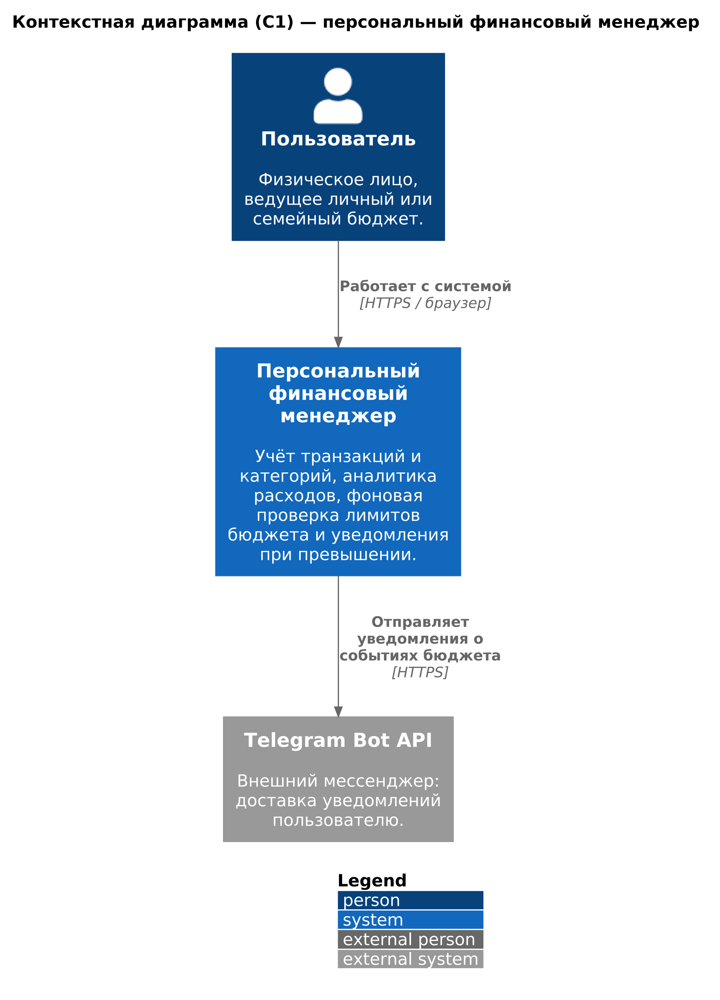
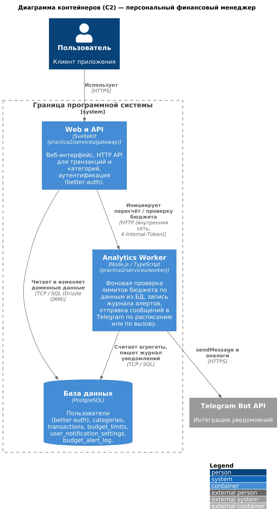
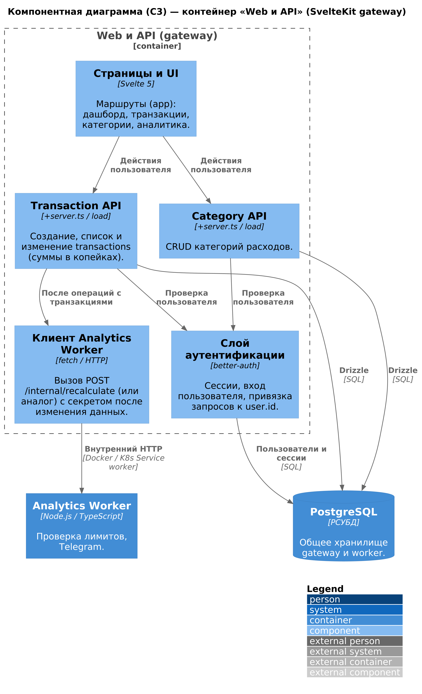

# Практика 1 — архитектура (C4)

**Тема:** персональный финансовый менеджер с фоновой аналитикой и уведомлениями.  
Репозиторий курса: приложение на базе SvelteKit (`whynot-finances-svelte`) плюс отдельный сервис **Analytics Worker** (планируется в `practice2/services/worker`).

---

## Problem Statement

1. **Пользователи:** частные лица, которые хотят учитывать доходы и расходы, группировать операции по категориям и видеть аналитику за выбранные периоды; каждый пользователь работает только со своими данными.
2. **Основные функции:** регистрация и вход; ведение категорий и транзакций; просмотр сводок и графиков; настройка **лимитов бюджета** по месяцу (по категории или по всем расходам).
3. **Фоновая аналитика:** отдельный сервис периодически и/или по событию от **веб-приложения** пересчитывает расходы за текущий месяц, сравнивает их с лимитами и фиксирует факты превышения.
4. **Уведомления:** при превышении лимита пользователь получает сообщение во **внешний канал** — в проекте запланирована интеграция с **Telegram Bot API** (chat id хранится в настройках пользователя).
5. **Внешние системы:** **PostgreSQL** — единое хранилище для веб-приложения и воркера; **Telegram** — доставка уведомлений; провайдеры входа (OAuth/пароль) остаются в рамках существующей конфигурации **better-auth**.

---

## Диаграммы

Экспорт выполнен локально: **PlantUML** (образ `plantuml/plantuml`) с библиотекой [C4-PlantUML](https://github.com/plantuml-stdlib/C4-PlantUML). Исходники: [`diagrams/context.puml`](./diagrams/context.puml), [`diagrams/container.puml`](./diagrams/container.puml), [`diagrams/component.puml`](./diagrams/component.puml).

Размер изображений **не ниже 1200×800 px** (фактически ширина ≈2000–2250 px).

По методичке допустимы **скриншот** или **встроенное изображение**. Ниже — встроенные PNG; в GitHub / Cursor откройте **Preview** для `README.md`, если картинки не видны в сыром виде.

### C1 — контекст

**Рисунок 1.** Контекстная диаграмма (C1)

<p align="center">
  
</p>

Исходник PlantUML: [`diagrams/context.puml`](./diagrams/context.puml)

| Аспект          | Что часто «предлагает» ИИ без доработки                                               | Что зафиксировано вручную в финальной диаграмме                                    | Обоснование                                                                                                                |
| --------------- | ------------------------------------------------------------------------------------- | ---------------------------------------------------------------------------------- | -------------------------------------------------------------------------------------------------------------------------- |
| Граница системы | Несколько пересекающихся прямоугольников «фронт / бэк / БД» на одном уровне контекста | Одна система «Персональный финансовый менеджер»; БД и воркер **не** показаны на C1 | По C4 на уровне контекста виден обмен с **внешними** акторами и системами; PostgreSQL находится внутри нашей границы на C2 |
| Внешние системы | Случайные API (банки, Open Banking) без требований                                    | Только **Telegram Bot API** как реально запланированный канал уведомлений          | Соответствие объёму MVP и теме «уведомления»                                                                               |
| Подписи связей  | «REST», «JSON» без смысла для бизнеса                                                 | «Работает с системой», «Отправляет уведомления о событиях бюджета»                 | Читаемость для неразработчиков                                                                                             |

### C2 — контейнеры

**Рисунок 2.** Диаграмма контейнеров (C2)

<p align="center">
  
</p>

Исходник PlantUML: [`diagrams/container.puml`](./diagrams/container.puml)

| Аспект                 | Типичные ошибки / «галлюцинации» ИИ                                                   | Что исправлено / учтено вручную                                                                        | Обоснование                                                                    |
| ---------------------- | ------------------------------------------------------------------------------------- | ------------------------------------------------------------------------------------------------------ | ------------------------------------------------------------------------------ |
| Количество контейнеров | Лишние микросервисы (API Gateway, отдельный Auth Server, Message Bus) при простом MVP | Ровно **Web и API** (SvelteKit), **Analytics Worker**, **PostgreSQL**                                  | Достаточно для требований курса (≥2 сервиса) без искусственного усложнения     |
| Поток данных           | Пользователь напрямую к БД или к воркеру                                              | Пользователь ходит только в **gateway**; воркер вызывается по **HTTP** из gateway и ходит в **БД** сам | Соответствие реалистичному развёртыванию и будущему Ingress только на веб-слой |
| Очередь                | Kafka/RabbitMQ «по умолчанию»                                                         | На C2 очередь **не** рисуется; при появлении Redis на П2 диаграмму можно обновить                      | Асинхрон через брокер — опциональное усложнение, не обязательное для зачёта    |
| Имена                  | Абстрактные «Backend»                                                                 | Явные пути **`practice2/services/gateway`** и **`practice2/services/worker`**                          | Согласованность с планом сдачи и методичкой                                    |

### C3 — компоненты (контейнер gateway)

**Рисунок 3.** Компонентная диаграмма (C3), контейнер gateway

<p align="center">
  
</p>

Исходник PlantUML: [`diagrams/component.puml`](./diagrams/component.puml)

| Аспект           | Что может выдать ИИ         | Что зафиксировано вручную                                                             | Обоснование                                                                     |
| ---------------- | --------------------------- | ------------------------------------------------------------------------------------- | ------------------------------------------------------------------------------- |
| Декомпозиция     | Классы MVC из другого стека | **UI**, **better-auth**, отдельные **Transaction / Category API**, **клиент воркера** | Соответствие структуре SvelteKit (`+server.ts`, server load)                    |
| Связь с воркером | Неясный «event bus»         | Явная связь **internal HTTP** из API транзакций к контейнеру **Analytics Worker**     | Прослеживаемый сценарий «после изменения транзакции — триггер проверки бюджета» |
| База             | Дублирование БД на C3       | Одна **PostgreSQL** вне границы gateway, общая для gateway и worker                   | Избегаем ложного впечатления о двух БД                                          |

---

## Вывод о пригодности ИИ для архитектурного проектирования

ИИ полезен как **ускоритель черновика**: быстро получить синтаксис C4-PlantUML, варианты формулировок и напоминание про типовые элементы (Person, System_Ext, ContainerDb). Без **ручной** проверки модель часто избыточна (лишние сервисы, брокеры, внешние API), слабо согласована между уровнями C1–C3 или не совпадает с реальным стеком (SvelteKit + один worker). Для учебной и производственной архитектуры итоговым источником истины должны оставаться **доработанные вручную** диаграммы и явное сопоставление с кодом и инфраструктурой.

---

## Пересборка PNG из `.puml`

Имя выходного файла совпадает с идентификатором после `@startuml` в каждом `.puml` (здесь это **`context`**, **`container`**, **`component`** → `context.png`, `container.png`, `component.png`).

Из корня репозитория `pw9-12` (нужен Docker):

```bash
docker run --rm -v "$(pwd)/practice1/diagrams:/data" plantuml/plantuml -charset UTF-8 -tpng \
  /data/context.puml /data/container.puml /data/component.puml
```
