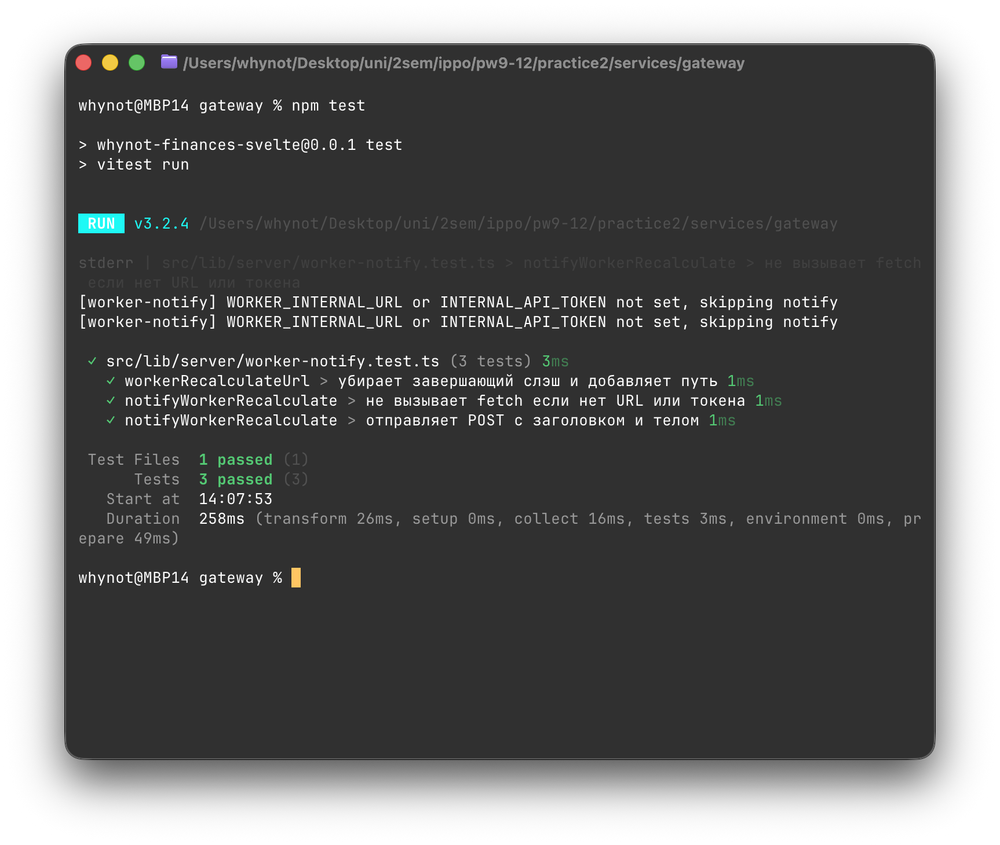
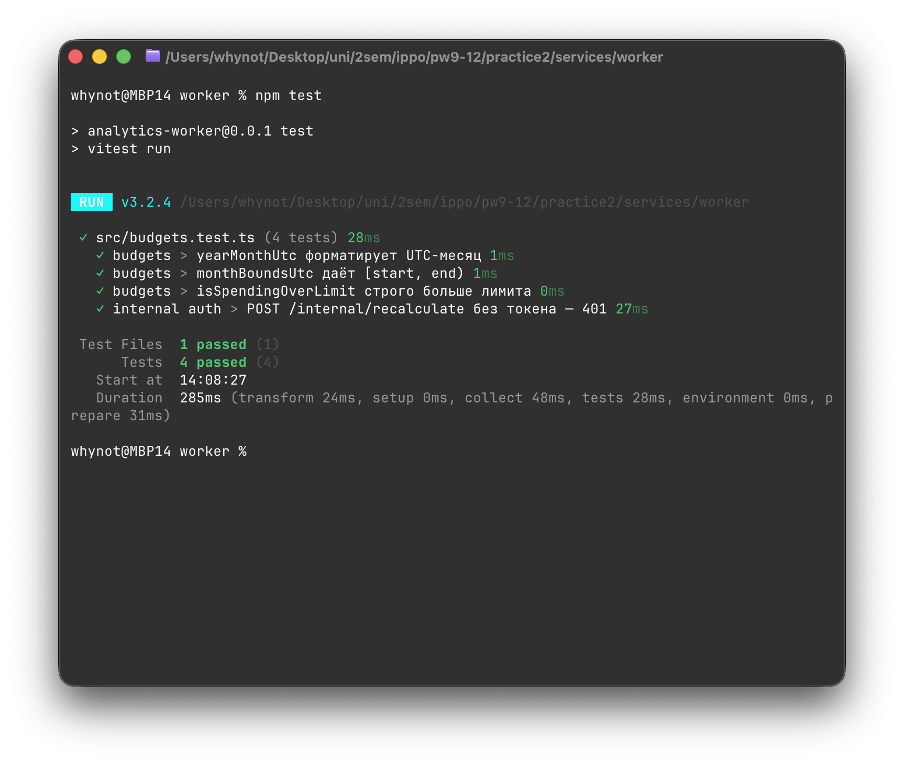
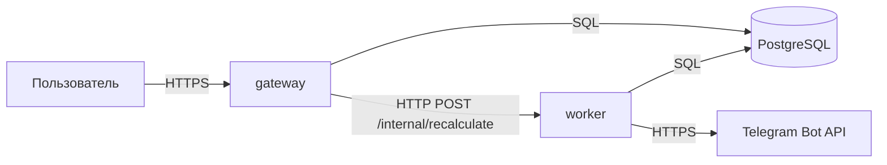
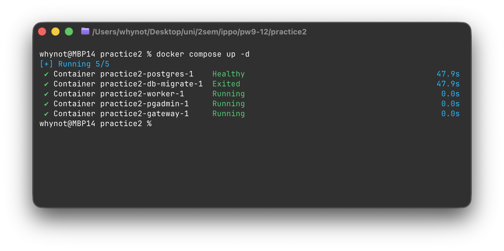

# Практика 2 — отчёт (MVP, микросервисы, Docker, тесты)

## Ссылка на репозиторий

[https://github.com/Whynot830/tsdis-pw9-12](https://github.com/Whynot830/tsdis-pw9-12)

## Тема

Персональный финансовый менеджер с фоновой аналитикой и уведомлениями: **gateway** (SvelteKit) и **Analytics Worker** (Node.js/Fastify), общая БД PostgreSQL, внутренний вызов `POST /internal/recalculate`, интеграция с Telegram (опционально).

## Использованные ИИ-инструменты

ИИ-агенты использовались для генерации кода микросервисов, автотестов и файла **`docker-compose.yml`**, а также черновиков документации в README.

- **Cursor** (IDE с агентом и инструментами проекта).
- **Anysphere Composer 2 Fast** — основной режим для генерации и правок кода, compose, worker, фрагментов gateway и документации по ходу итераций.
- Дополнительно: встроенный чат Cursor для точечных вопросов по ошибкам сборки и TypeScript.

Отдельно от генерации кода использовались **официальные документации**: SvelteKit, Drizzle ORM, Fastify, better-auth, Docker Compose.

## Примеры промптов

Ниже — обобщённые формулировки запросов, которые ускорили появление рабочего каркаса (точный текст диалогов не сохранялся).

1. *«Добавь второй сервис — worker на Fastify + TypeScript: эндпоинт `POST /internal/recalculate` с проверкой секрета, чтение лимитов и транзакций из Postgres, сравнение с лимитом за UTC-месяц, запись в журнал алертов и вызов Telegram Bot API при первом срабатывании. Gateway после создания транзакции дергает worker по HTTP.»*

2. *«Собери `docker-compose.yml`: Postgres с healthcheck, образы gateway и worker, общая сеть, переменные для `DATABASE_URL`, `INTERNAL_API_TOKEN`, `TELEGRAM_BOT_TOKEN`; опиши в README порядок запуска.»*

3. *«Расширь Drizzle-схему: таблицы для лимитов бюджета, настроек уведомлений (`telegram_chat_id`), журнала алертов; добавь минимальные Vitest-тесты на gateway (уведомление воркера) и на worker (401 без токена, проверка функций бюджета).»*

## Оценка доли ИИ и ручной работы

Ориентировочно **около 80%** объёма изменений (структура сервисов, worker, compose, часть правок gateway, тесты, черновики README) сформировано в диалоге с **Composer 2 Fast** с последующим локальным прогоном.

**Около 20%** — ручная доработка и отладка: согласование переменных окружения с реальным входом (better-auth, Google OAuth на HTTP), правка `ORIGIN` и cookies, проверка путей в compose, ручное заполнение `user_notification_settings` и лимитов для демонстрации Telegram, проверка, что секреты не попадают в Git.

Точный подсчёт строк «ИИ / человек» не ведётся; соотношение задано как качественная оценка по итогам работы.

## Ошибки и «галлюцинации» ИИ

Существенных архитектурных ошибок после первого цикла не осталось. Из того, что приходилось поправлять вручную или уточнять в промпте:

- **Смешение `DATABASE_URL` для хоста и контейнера:** черновые варианты иногда подразумевали один `.env` на все сервисы; при подстановке в gateway внутри Docker адрес `127.0.0.1` вёл к отказу подключения к БД — **исправление:** явно задать хост `postgres` в `docker-compose.yml` для сервисов в контейнере и не подставлять в общий `.env` URL только для хоста.
- **Мелкие неточности в текстах README** (формулировки шагов, предупреждения про `db-migrate`) — **исправление:** вычитка и дополнение вручную.
- В одном из ранних ответов фигурировали **избыточные** элементы вне темы (лишний сервис/фича «на будущее») — **исправление:** сокращение до минимально достаточного MVP.

Явных «галлюцинаций» в виде несуществующих API или неверного adapter для продакшн-сборки после финальной сборки не фиксировалось.

## Успешное прохождение автотестов

```bash
npm test --prefix practice2/services/gateway
npm test --prefix practice2/services/worker
```





## Схема взаимодействия микросервисов

Архитектурно согласовано с диаграммой контейнеров (С4, уровень контейнеров) из **practice 1**: [`practice1/diagrams/container.png`](../practice1/diagrams/container.png) в том же репозитории.

Пользователь обращается к **gateway** по HTTPS; **gateway** работает с **PostgreSQL**; после создания транзакции **gateway** вызывает **worker** (`POST /internal/recalculate`, внутренний токен); **worker** читает и пишет **PostgreSQL** и при алерте обращается к **Telegram Bot API** (HTTPS).



## Логи Docker Compose

Запуск и переменные окружения описаны в [`README.md`](./README.md).



## Структура каталогов

- `practice2/services/gateway` — первый микросервис (Dockerfile в корне сервиса).
- `practice2/services/worker` — второй микросервис.
- `practice2/docker-compose.yml` — локальный запуск всех сервисов.
