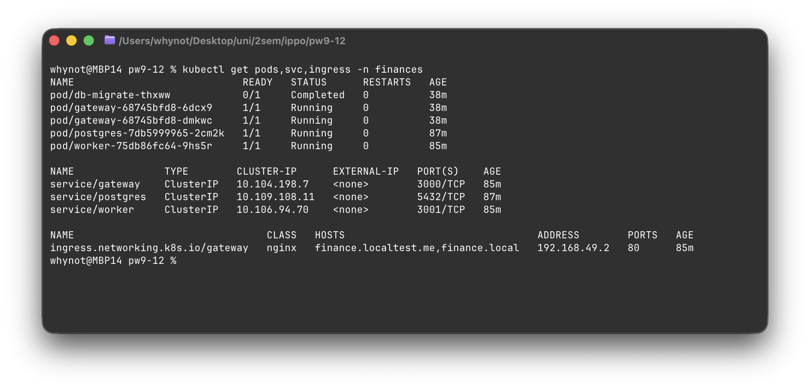
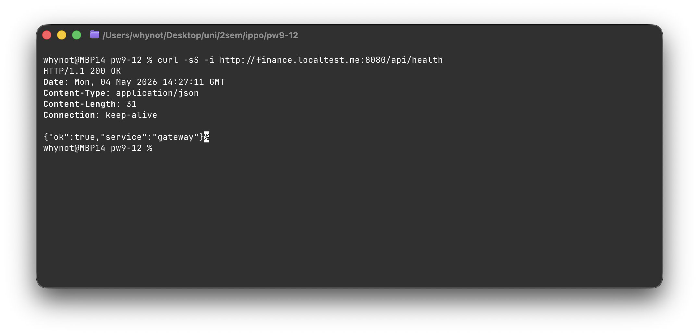
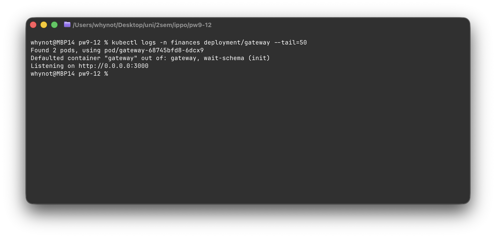

# Практика 3 — отчёт (Kubernetes, Minikube, Ingress)

## 1. Микросервисы и Docker-образы

| Компонент | Тип в Kubernetes | Образ |
|-----------|-------------------|--------|
| **Gateway** (веб + API, наружу через Ingress) | `Deployment` `gateway` | `finance-gateway:latest` |
| **Worker** (внутренний HTTP) | `Deployment` `worker` | `finance-worker:latest` |
| **PostgreSQL** | `Deployment` `postgres` | `postgres:16-alpine` |
| **Миграции БД** (одноразовый запуск) | `Job` `db-migrate` | `finance-db-migrate:latest` |

Сборка образов приложения: `practice2/services/gateway/Dockerfile`, `Dockerfile.migrate`, `practice2/services/worker/Dockerfile`. В Minikube — с `eval $(minikube docker-env)` и `imagePullPolicy: Never`.

---

## 2. Развёртывание в Minikube (шаги)

1. Запуск кластера и Ingress: `minikube start --driver=docker`, `minikube addons enable ingress`.
2. Сборка образов **внутри** окружения Docker Minikube:
   ```bash
   eval $(minikube docker-env)
   docker build -t finance-gateway:latest -f practice2/services/gateway/Dockerfile practice2/services/gateway
   docker build -t finance-worker:latest -f practice2/services/worker/Dockerfile practice2/services/worker
   docker build -t finance-db-migrate:latest -f practice2/services/gateway/Dockerfile.migrate practice2/services/gateway
   ```
3. Подготовить Secret (из корня репозитория): скопировать `practice3/k8s/secret.example.yaml` → `practice3/k8s/k8s-secret.local.yaml` и при необходимости отредактировать (секреты не коммитить).
4. Применить манифесты: **`./practice3/deploy-minikube.sh`** или пошагово — см. [`README.md`](./README.md) (`kubectl apply` namespace, ConfigMap, Secret, Postgres, Job миграций, worker, gateway, Ingress; дождаться **Job** `db-migrate` **Complete**).
5. Доступ с хоста через Ingress (на **macOS** с driver Docker удобно): **`./practice3/deploy-minikube.sh --serve`** — патч **ORIGIN**, **port-forward** Ingress на **:8080**, в браузере **http://finance.localtest.me:8080/**. Подробности — [`README.md`](./README.md).

---

## 3. Иллюстрации



*Рисунок 1 — Поды, сервисы и Ingress в пространстве имён finances после развёртывания.*



*Рисунок 2 — Доступ к приложению через Ingress.*



*Рисунок 3 — Журнал работы контейнера gateway.*

---

## 4. Дополнительные усложнения (по желанию)

**StatefulSet** для БД, **HPA**, **Service Mesh** в этой работе **не реализованы**.

Сверх базового набора объектов добавлены: **PersistentVolumeClaim** для PostgreSQL, **Job** миграций схемы, **initContainers** у gateway/worker до появления таблиц после миграции. Манифесты: каталог [`k8s/`](./k8s/).

---

Репозиторий: [https://github.com/Whynot830/tsdis-pw9-12](https://github.com/Whynot830/tsdis-pw9-12). Расширенная инструкция и отладка: [`README.md`](./README.md).
