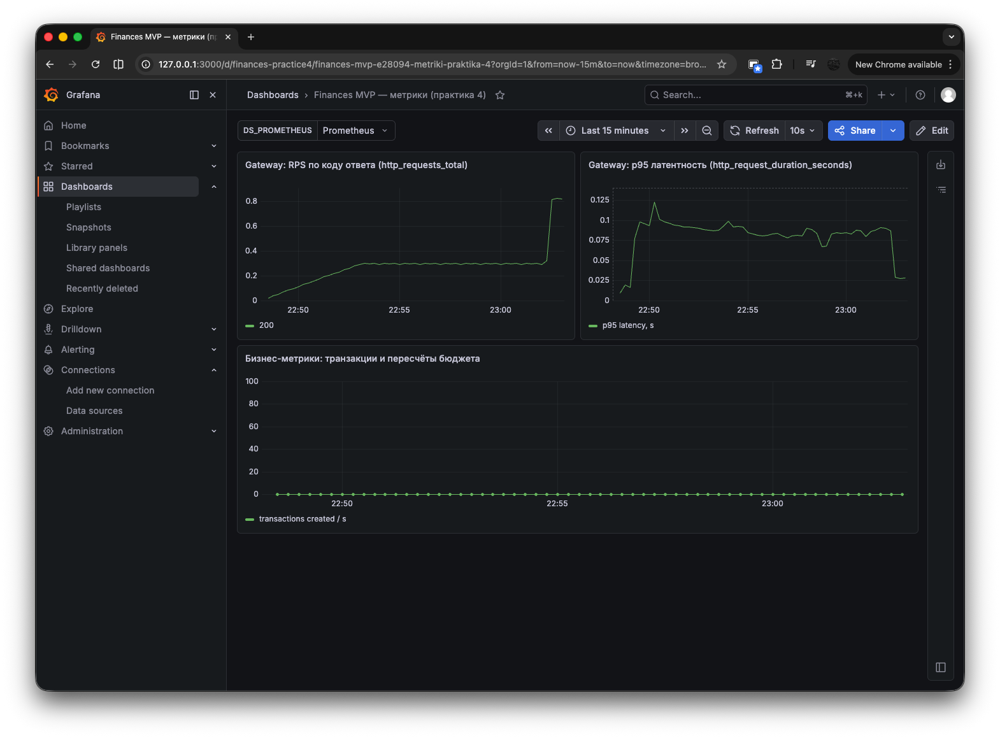
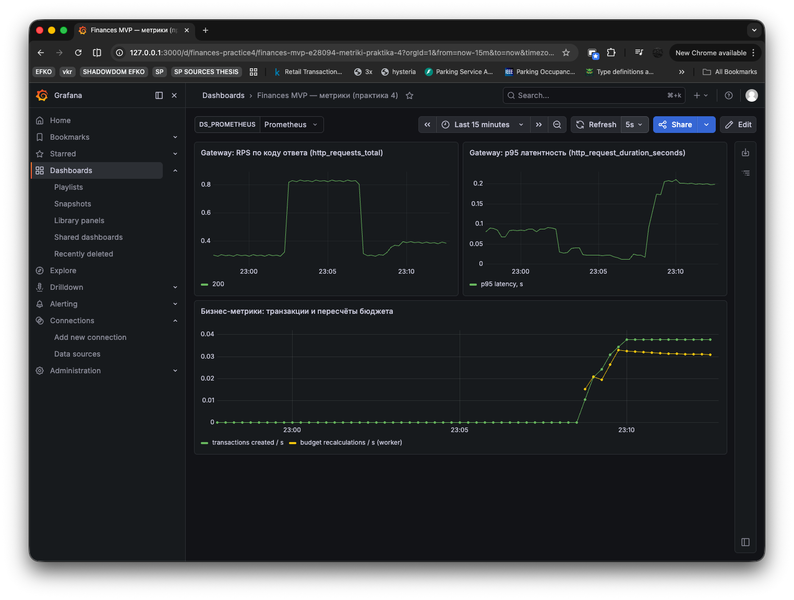
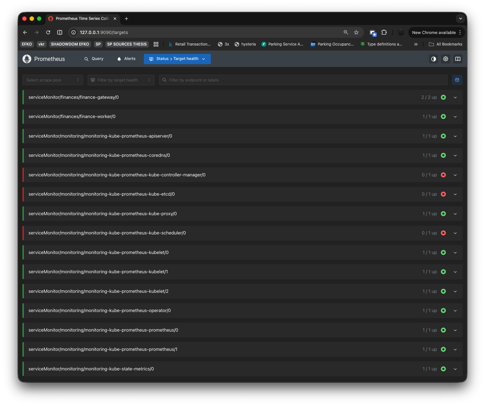

# Практика 4 — отчёт (мониторинг в Kubernetes: Prometheus + Grafana)

Стек приложения тот же, что в работах 2–3: персональный финансовый менеджер (**gateway** на SvelteKit, **worker** на Fastify, **PostgreSQL**). Цель этой работы — подключить наблюдаемость: экспорт метрик в формате **Prometheus**, их сбор в кластере и визуализацию в **Grafana**.

---

## 1. Репозиторий и тема

**Репозиторий:** [https://github.com/Whynot830/tsdis-pw9-12](https://github.com/Whynot830/tsdis-pw9-12).

**Тема проекта:** веб-учёт транзакций и категорий, фоновый пересчёт лимитов бюджета и при необходимости уведомления; внешний вход — через **gateway**, внутренняя логика частично на **worker**.

---

## 2. Выбор системы мониторинга и обоснование

Выбраны **Prometheus** (хранение и запросы) и **Grafana** (дашборды), поставленные одним Helm-релизом **`kube-prometheus-stack`** (`prometheus-community`). Такой набор хорошо стыкуется с текстовым эндпоинтом **`/metrics`** и библиотекой **`prom-client`** в Node.js; оператор Prometheus поддерживает декларативные объекты **ServiceMonitor**, не требуя вручную править конфиг Prometheus при добавлении сервисов. В одном релизе уже есть типовые дашборды по кластеру; дополнительно импортирован собственный JSON с панелями по приложению.

Альтернативы вроде стека на OpenTelemetry (SigNoz и т.п.) возможны, но для учебной задачи «счётчики + гистограмма + бизнес-counter» связка Prometheus + Grafana даёт короткий путь без отдельного коллектора OTLP.

---

## 3. Метрики, которые экспортирует приложение

### Gateway (порт 3000 в поде)

| Имя                                  | Тип                                 | Назначение                                               |
| ------------------------------------ | ----------------------------------- | -------------------------------------------------------- |
| `http_requests_total`                | Counter (`method`, `route`, `code`) | Объём запросов и распределение кодов ответа по маршрутам |
| `http_request_duration_seconds`      | Histogram (`method`, `route`)       | Задержки обработки                                       |
| `finance_transactions_created_total` | Counter                             | Успешное создание транзакции после записи в БД           |

`GET /metrics` отдаётся до прохождения better-auth, чтобы scrape не упирался в редиректы логина.

### Worker (порт 3001)

| Имя                                    | Тип                                 | Назначение                                                            |
| -------------------------------------- | ----------------------------------- | --------------------------------------------------------------------- |
| `worker_http_requests_total`           | Counter (`method`, `route`, `code`) | HTTP-метрики воркера (`/health`, `/internal/recalculate`, `/metrics`) |
| `worker_http_request_duration_seconds` | Histogram                           | Длительность запросов                                                 |
| `finance_budget_recalculations_total`  | Counter (`result`)                  | Исход пересчёта бюджета (`ok` / `error`)                              |

Префикс `worker_` у HTTP-метрик воркера уменьшает риск совпадения имён с gateway в одном Prometheus.

Реализация: [`practice2/services/gateway/src/lib/server/metrics.ts`](../practice2/services/gateway/src/lib/server/metrics.ts), [`practice2/services/worker/src/metrics.ts`](../practice2/services/worker/src/metrics.ts).

---

## 4. Настройка сбора метрик

Сбор настроен через ресурсы **ServiceMonitor** (Prometheus Operator):

- [`monitoring/servicemonitor-gateway.yaml`](./monitoring/servicemonitor-gateway.yaml) — Service `gateway` в namespace `finances`, порт `http`, путь `/metrics`.
- [`monitoring/servicemonitor-worker.yaml`](./monitoring/servicemonitor-worker.yaml) — аналогично для `worker`.

В [`monitoring/kube-prometheus-stack-values-minikube.yaml`](./monitoring/kube-prometheus-stack-values-minikube.yaml) для учебного кластера заданы облегчённые ресурсы и открытый выбор ServiceMonitor по namespace (`serviceMonitorSelector: {}`), чтобы манифесты из `finances` подхватывались без жёсткой привязки к label релиза Helm.

Проверка: в UI Prometheus раздел **Status → Targets** — scrape-цели приложения в состоянии **UP**.

---

## 5. Дашборд в Grafana и иллюстрации

Импорт: [`monitoring/dashboards/finance-metrics-min.json`](./monitoring/dashboards/finance-metrics-min.json). Три основные панели:

1. **RPS по коду ответа** — `sum by (code) (rate(http_requests_total[5m]))`.
2. **p95 латентности gateway** — квантиль по `http_request_duration_seconds_bucket`.
3. **Бизнес-серии** — скорости `finance_transactions_created_total` и `finance_budget_recalculations_total`.

Ниже — встроенные изображения из каталога `screenshots/` (подписи соответствуют содержанию панелей).

_Рисунок 1 — Дашборд после нагрузочного прогона по публичному health: виден рост RPS с кодом 200; бизнес-метрики остаются у нуля, если не выполнялись операции создания транзакций._

_Рисунок 2 — Тот же дашборд при появлении бизнес-трафика: растут скорости создания транзакций и пересчётов бюджета на worker; на фоне меняется картина по HTTP и p95._

_Рисунок 3 — Подтверждение, что Prometheus забирает метрики с обоих сервисов приложения._

Имена файлов рисунков 1–2 должны совпадать с реальными файлами в [`screenshots/`](./screenshots/README.md) (при переименовании поправьте путь в `` выше).

---

## 6. Нагрузочный тест и интерпретация

Скрипт: [`monitoring/load-test-public-health.sh`](./monitoring/load-test-public-health.sh) (по умолчанию **150** запросов к `BASE_URL/api/health`).

**Наблюдения по метрикам:** при прогоне только health растут счётчики и RPS с кодом **200** по соответствующим маршрутам; **p95** для лёгкого эндпоинта обычно остаётся низким. **Бизнес-счётчики** заметно реагируют после **POST** создания транзакции (и косвенно — на пересчёты на worker); это видно на **рисунке 2** по сравнению с **рисунком 1**.

_(При необходимости допишите сюда 1–2 предложения под ваши фактические цифры времени и всплеска RPS.)_

---

## 7. Использование ИИ

При работе использовалась среда **Cursor** (агент): черновики инструментирования `prom-client`, хуки SvelteKit и Fastify, манифесты ServiceMonitor, Helm values, структура каталога `practice4/`, скрипты локального доступа и тексты отчёта. Проверка на живом Minikube, соответствие портов Grafana (**80** внутри сервиса) и порядок `port-forward` выполнялись вручную.

---

## 8. Вывод

Метрики **HTTP** (объём, коды, задержки) помогают отслеживать доступность и качество ответов **gateway**; **бизнес-счётчики** связывают техническое состояние с реальными операциями пользователя (создание транзакций) и фоновой обработкой на **worker**. Раздельный scrape двух сервисов упрощает понимание, на каком уровне возникла аномалия — на внешнем API или во внутреннем пересчёте. В связке «инструментирование → Prometheus → Grafana» отражён типичный для микросервисов контур наблюдаемости.

---

Инструкция по командам и скриптам: [`README.md`](./README.md).
